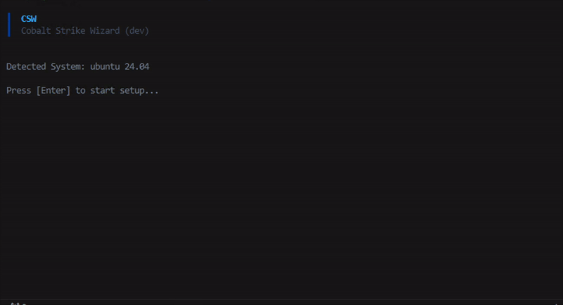

# CSW

Cobalt Strike Wizard. Retrieves the latest version of Cobalt Strike and installs it with dependencies.

To use, download from releases page, extract and run `csw` and follow the prompts.

Releases are created automatically from the latest tag. The source code is available on GitHub and can be audited by anyone.

### Supported Platforms

| OS | Distributions | Status |
| :--- | :--- | :--- |
| **Linux** (x64/ARM64) | Debian, Ubuntu, Kali | ✅ (Verified) |
| | Fedora, CentOS, RHEL | ⚠️ (Not Verified) |
| | Arch, Manjaro | ⚠️ (Not Verified) |
| **Windows** (x64) | Windows 10, Windows 11 | ✅ (Verified) |
| **macOS** (Intel/Silicon) | macOS 12+ | ⚠️ (Not Verified) |

> Testing has only been performed on Debian, Ubuntu, and Windows. Other distributions may work, but are not guaranteed to function correctly.

### Motivations

Mainly I wanted to build an installer that was not a bash or ansible script and compatible with all distributions. My hope is that this will be addressed in the future with an official wizard. 

It also serves as a template that can be forked for other teams wanting to build similar tooling.

### Credits

- **[Kleiton Kurti (kleiton0x00)](https://github.com/kleiton0x00)** for [Malleable-CS-Profiles](https://github.com/WKL-Sec/Malleable-CS-Profiles) which provides the Malleable C2 profiles used by CSW when doing a server install.
